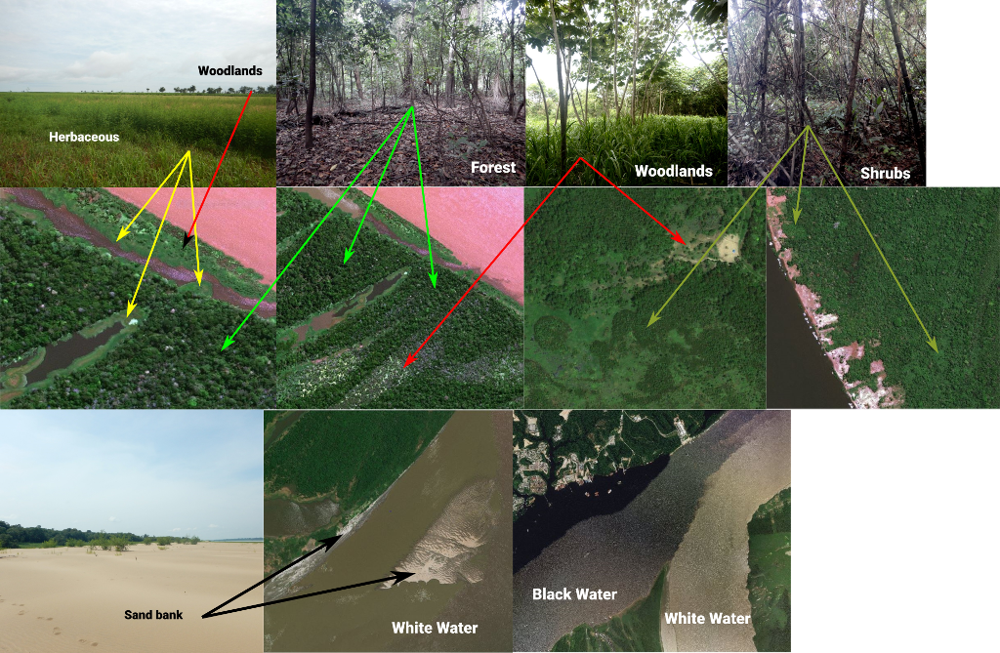

### **Olá! Obrigado por colaborar com o projeto PEER e o mapeamento das áreas úmidas amazônicas!**

Este aplicativo permite que você marque pontos de referência para tipos conhecidos de habitats nas planícies de inundação na Amazônia. Estes dados serão essenciais para que possamos melhorar os mapas atuais de distribuição destes habitats, para todo o Rio Amazonas e seus tributários.

Caso haja alguma dúvida, entre em contato com Thiago Silva (thiago.sf.silva@unesp.br). Obrigado!

### **Como fazer?**

#### **1) Selecione os pontos de referência**

Para começar a identificar os habitats, clique na aba **'Seleção de Amostras'**, á esquerda. Navegue pelo mapa até encontrar uma região de planície de inundação **que você conheça bem**. A partir daí, selecione um tipo de habitat na janela à direita, **aproxime o zoom a até uma escala de pelo menos 200 metros** (veja barra de escala acima do mapinha de referência, no canto inferior esquerdo), e começe a clicar em áreas que representem o habitat selecionado. Para identificar um tipo diferente de habitat basta trocar a seleção da classe de habitat na janela à direita, e continuar clicando. Nào há problema em trocar de habitat várias vezes, conforme você vai "navegando" a região. Tente identificar o máximo possível de tipos de habitat diferentes dentro do seu conhecimento de campo.

**IMPORTANTE: não tente "adivinhar" habitats em regiões que você não conhece. Isso só piora o nosso trabalho. Concentre seus esforços nas áreas em que você tem conhecimento de campo!**

*Dicas:*

- Evite clicar em bordas e áreas de transição.

- Não tenha medo de selecionar vários pontos para cada habitat em cada local. Quanto mais, melhor, mesmo que eles estejam próximos!

- Na próxima etapa, será possível remover pontos errados, não se preocupe.

#### **2) Revise seus pontos e envie os dados finais**

Quando terminar a coleta de pontos, clique no botão *'Finalizar'* e vá para a aba **'Revisão'**. **Não será mais possível adicionar pontos após a finalização** (a menos que você inicie uma nova sessão). 

Clique em **'Desenhar Pontos'** para visualizar os seus pontos. Se houve algum ponto marcado errado na etapa anterior, procure-o na lista e clique em *'Delete'*. Lembre-se de clicar novamente em *'Desenhar pontos'* cada vez que excluir um ou mais pontos, se quiser conferir a remoção no mapa (não conseguimos descobrir ainda como fazer o mapa se atualizar automaticamente). Depois de conferir e corrigir, clique em *'Enviar Dados'*, preencha suas informações, e finalize. **E obrigado!**

### **Descrição dos habitats:**

**Nós estamos, neste momento, buscando pontos de referência para os seguintes habitats:**

- *Varzea Forest (Floresta de várzea)*: florestas fechadas crescendo em planícies de água branca.

- *Igapo Forest (Floresta de igapó)*: florestas fechadas crescendo em planícies de água preta ou clara.

- *Woodlands (Áreas abertas)*: áreas abertas de sucessão inicial, com predomínio de 'Embaúba' (*Cecropia* spp.), 'Munguba'(*Pseudobombax munguba*), palmeiras, chavascais e outras vegetações de dossel mais aberto do que uma floresta.

- *Shrubs (Arbustos)*: áreas cobertas por arbustos densos e de dossel fechado, incluindo aningais (*Montrichardia*).

- *Herbaceous/Mud (Herbácea/lama)*: áreas onde plantas herbáceas e macrófitas se desenvolvem em algum período do ano. Isso inclui espécies terrestres, emersas e flutuantes, e fundos de lago que normalmente são rapidamente ocupados por vegetação após secarem. *Se você sabe que a área é ocupada por essas plantas em algum momento, marque mesmo que elas não apareçam na imagem.*

- *Urban (Urbano)*: áreas de adensamento urbano.

- *Sand Bank (Bancos de areia)*: bancos de areia e praias que ficam expostas durante as águas baixas. *Se você sabe que a área é ocupada por areia em algum momento, marque mesmo que não apareça na imagem.*

- *Bare Rocks (Rochas nuas)*: áreas de rocha exposta, como corredeiras e pedrais.

- *White Water (Água Branca)*: igarapés, rios e lagos de água branca.

- *Black Water (Água Preta)*: igarapés, rios e lagos de água preta.

- *Clear Water (Água Clara)*: igarapés, rios e lagos de água clara.

**Exemplos:**

